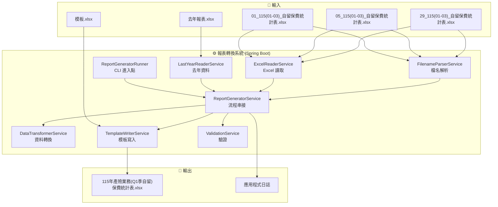
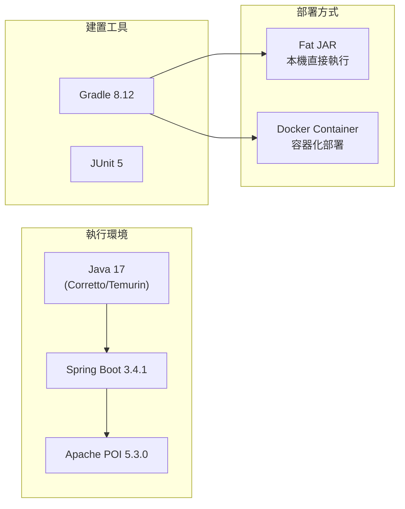

← [回到索引](README.md)

# 第四章：系統架構圖

---

## 1. 整體架構

```mermaid
graph TB
    subgraph Input["📂 輸入"]
        SRC1["29_115(01-03)_自留保費統計表.xlsx"]
        SRC2["05_115(01-03)_自留保費統計表.xlsx"]
        SRC3["01_115(01-03)_自留保費統計表.xlsx"]
        TMPL["模板.xlsx"]
        LAST["去年報表.xlsx"]
    end

    subgraph App["⚙️ 報表轉換系統 (Spring Boot)"]
        RUNNER["ReportGeneratorRunner<br/>CLI 進入點"]
        GEN["ReportGeneratorService<br/>流程串接"]
        FP["FilenameParserService<br/>檔名解析"]
        ER["ExcelReaderService<br/>Excel 讀取"]
        DT["DataTransformerService<br/>資料轉換"]
        TW["TemplateWriterService<br/>模板寫入"]
        LY["LastYearReaderService<br/>去年資料"]
        VS["ValidationService<br/>驗證"]
    end

    subgraph Output["📄 輸出"]
        OUT["115年產險業務(Q1季自留)保費統計表.xlsx"]
        LOG["應用程式日誌"]
    end

    SRC1 --> FP
    SRC2 --> FP
    SRC3 --> FP
    FP --> GEN
    SRC1 --> ER
    SRC2 --> ER
    SRC3 --> ER
    ER --> GEN
    GEN --> VS
    GEN --> DT
    LAST --> LY
    LY --> GEN
    GEN --> TW
    TMPL --> TW
    TW --> OUT
    GEN --> LOG
    RUNNER --> GEN
```

## 2. 技術架構

```mermaid
graph LR
    subgraph Runtime["執行環境"]
        JDK["Java 17<br/>(Corretto/Temurin)"]
        SB["Spring Boot 3.4.1"]
        POI["Apache POI 5.3.0"]
    end

    subgraph Build["建置工具"]
        GRD["Gradle 8.12"]
        JU["JUnit 5"]
    end

    subgraph Deploy["部署方式"]
        JAR["Fat JAR<br/>本機直接執行"]
        DCK["Docker Container<br/>容器化部署"]
    end

    GRD --> JAR
    GRD --> DCK
    JDK --> SB
    SB --> POI
```
