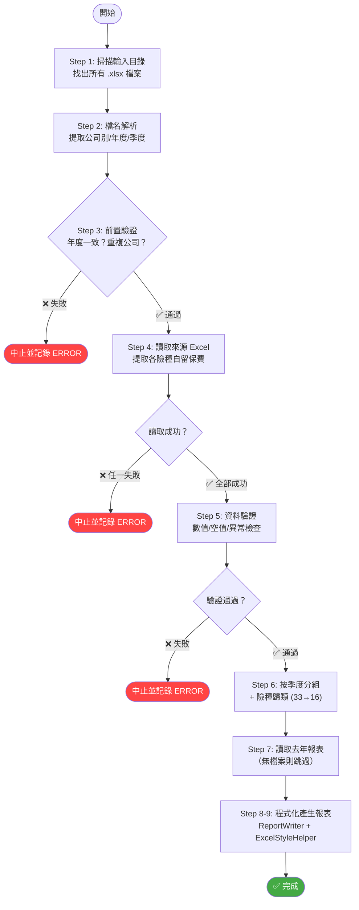
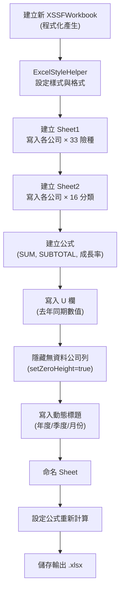

← [回到索引](README.md)

# 第五章：處理流程圖

---

## 1. 主流程

```mermaid
flowchart TD
    START([開始]) --> SCAN["Step 1: 掃描輸入目錄<br/>找出所有 .xlsx 檔案"]
    SCAN --> PARSE["Step 2: 檔名解析<br/>提取公司別/年度/季度"]
    PARSE --> PRE_VAL{"Step 3: 前置驗證<br/>年度一致？重複公司？"}

    PRE_VAL -->|❌ 失敗| ABORT1([中止並記錄 ERROR])
    PRE_VAL -->|✅ 通過| READ["Step 4: 讀取來源 Excel<br/>提取各險種自留保費"]

    READ --> READ_OK{"讀取成功？"}
    READ_OK -->|❌ 任一失敗| ABORT2([中止並記錄 ERROR])
    READ_OK -->|✅ 全部成功| DATA_VAL["Step 5: 資料驗證<br/>數值/空值/異常檢查"]

    DATA_VAL --> DATA_OK{"驗證通過？"}
    DATA_OK -->|❌ 失敗| ABORT3([中止並記錄 ERROR])
    DATA_OK -->|✅ 通過| GROUP["Step 6: 按季度分組<br/>+ 險種歸類 (33→16)"]

    GROUP --> LASTYEAR["Step 7: 讀取去年報表<br/>（無檔案則跳過）"]
    LASTYEAR --> WRITE["Step 8-9: 程式化產生報表<br/>ReportWriter + ExcelStyleHelper"]

    WRITE --> DONE([✅ 完成])

    style ABORT1 fill:#f44,color:#fff
    style ABORT2 fill:#f44,color:#fff
    style ABORT3 fill:#f44,color:#fff
    style DONE fill:#4a4,color:#fff
```

## 2. 報表產生細節流程

```mermaid
flowchart TD
    CREATE["建立新 XSSFWorkbook<br/>(程式化產生)"] --> STYLE["ExcelStyleHelper<br/>設定樣式與格式"]
    STYLE --> S1["建立 Sheet1<br/>寫入各公司 × 33 險種"]
    S1 --> S2["建立 Sheet2<br/>寫入各公司 × 16 分類"]
    S2 --> FORMULA["建立公式<br/>(SUM, SUBTOTAL, 成長率)"]
    FORMULA --> U["寫入 U 欄<br/>(去年同期數值)"]
    U --> HIDE["隱藏無資料公司列<br/>(setZeroHeight=true)"]
    HIDE --> TITLE["寫入動態標題<br/>(年度/季度/月份)"]
    TITLE --> RENAME["命名 Sheet"]
    RENAME --> RECALC["設定公式重新計算"]
    RECALC --> SAVE["儲存輸出 .xlsx"]
```
