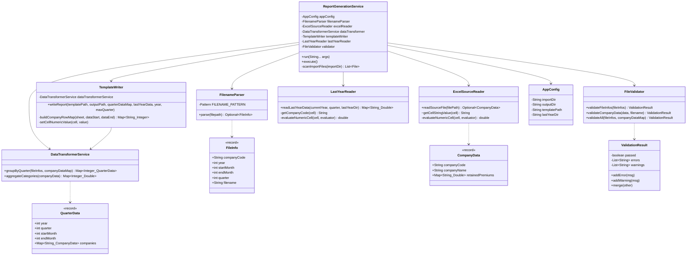
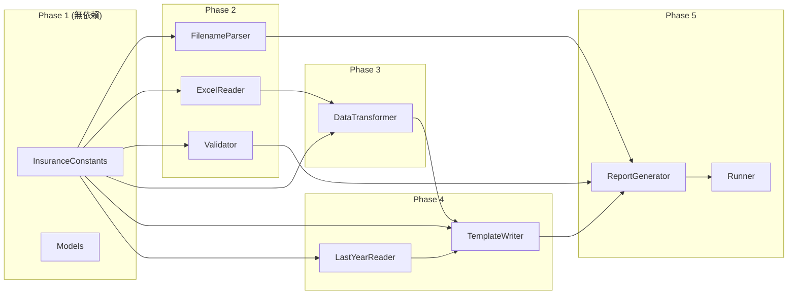

← [回到索引](README.md)

# 第六章：模組架構與類別圖

---

## 1. 類別圖

```mermaid
classDiagram
    class ReportGenerationService {
        -AppConfig appConfig
        -FilenameParser filenameParser
        -ExcelSourceReader excelReader
        -DataTransformerService dataTransformer
        -TemplateWriter templateWriter
        -LastYearReader lastYearReader
        -FileValidator validator
        +run(String... args)
        +execute()
        -scanImportFiles(importDir) List~File~
    }

    class FilenameParser {
        -Pattern FILENAME_PATTERN
        +parse(filepath) Optional~FileInfo~
    }

    class ExcelSourceReader {
        +readSourceFile(filePath) Optional~CompanyData~
        ~getCellStringValue(cell) String
        -evaluateNumericCell(cell, evaluator) double
    }

    class DataTransformerService {
        +groupByQuarter(fileInfos, companyDataMap) Map~Integer_QuarterData~
        +aggregateCategories(companyData) Map~Integer_Double~
    }

    class TemplateWriter {
        -DataTransformerService dataTransformerService
        +writeReport(templatePath, outputPath, quarterDataMap, lastYearData, year, maxQuarter)
        -buildCompanyRowMap(sheet, dataStart, dataEnd) Map~String_Integer~
        -setCellNumericValue(cell, value)
    }

    class LastYearReader {
        +readLastYearData(currentYear, quarter, lastYearDir) Map~String_Double~
        -getCompanyCode(cell) String
        -evaluateNumericCell(cell, evaluator) double
    }

    class FileValidator {
        +validateFileInfos(fileInfos) ValidationResult
        +validateCompanyData(data, filename) ValidationResult
        +validateAll(fileInfos, companyDataMap) ValidationResult
    }

    class AppConfig {
        -String importDir
        -String outputDir
        -String templatePath
        -String lastYearDir
    }

    class FileInfo {
        <<record>>
        +String companyCode
        +int year
        +int startMonth
        +int endMonth
        +int quarter
        +String filename
    }

    class CompanyData {
        <<record>>
        +String companyCode
        +String companyName
        +Map~String_Double~ retainedPremiums
    }

    class QuarterData {
        <<record>>
        +int year
        +int quarter
        +int startMonth
        +int endMonth
        +Map~String_CompanyData~ companies
    }

    class ValidationResult {
        -boolean passed
        -List~String~ errors
        -List~String~ warnings
        +addError(msg)
        +addWarning(msg)
        +merge(other)
    }

    ReportGenerationService --> AppConfig
    ReportGenerationService --> FilenameParser
    ReportGenerationService --> ExcelSourceReader
    ReportGenerationService --> DataTransformerService
    ReportGenerationService --> TemplateWriter
    ReportGenerationService --> LastYearReader
    ReportGenerationService --> FileValidator
    TemplateWriter --> DataTransformerService
    FilenameParser ..> FileInfo
    ExcelSourceReader ..> CompanyData
    DataTransformerService ..> QuarterData
    FileValidator ..> ValidationResult
```

## 2. 模組依賴關係

```mermaid
graph LR
    subgraph Phase1["Phase 1 (無依賴)"]
        IC["InsuranceConstants"]
        MOD["Models"]
    end

    subgraph Phase2["Phase 2"]
        FP["FilenameParser"]
        ER["ExcelReader"]
        VS["Validator"]
    end

    subgraph Phase3["Phase 3"]
        DT["DataTransformer"]
    end

    subgraph Phase4["Phase 4"]
        TW["TemplateWriter"]
        LY["LastYearReader"]
    end

    subgraph Phase5["Phase 5"]
        GEN["ReportGenerator"]
        RUN["Runner"]
    end

    IC --> FP
    IC --> ER
    IC --> VS
    IC --> DT
    IC --> TW
    IC --> LY
    ER --> DT
    DT --> TW
    LY --> TW
    FP --> GEN
    TW --> GEN
    VS --> GEN
    GEN --> RUN
```
