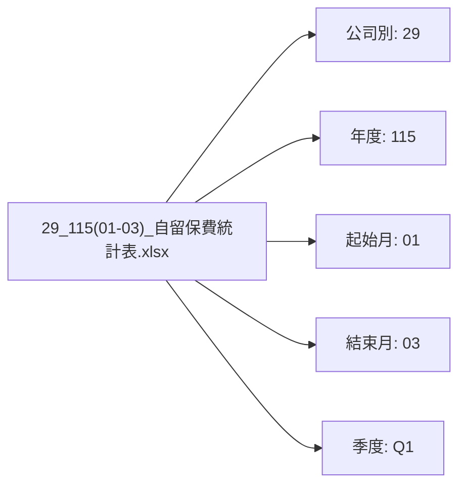
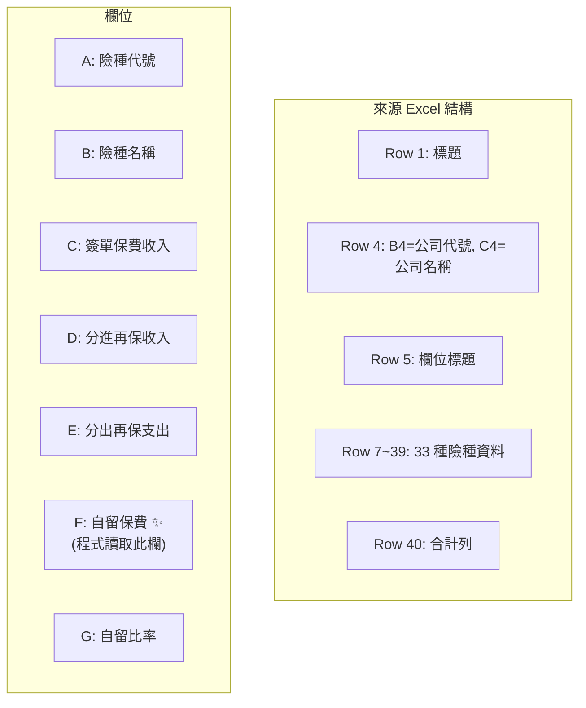
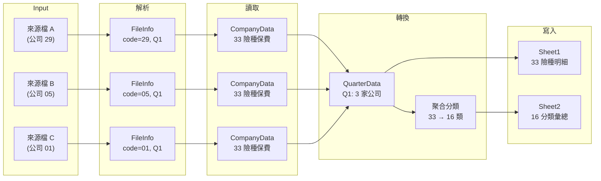
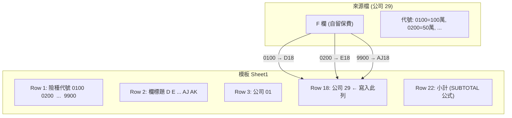
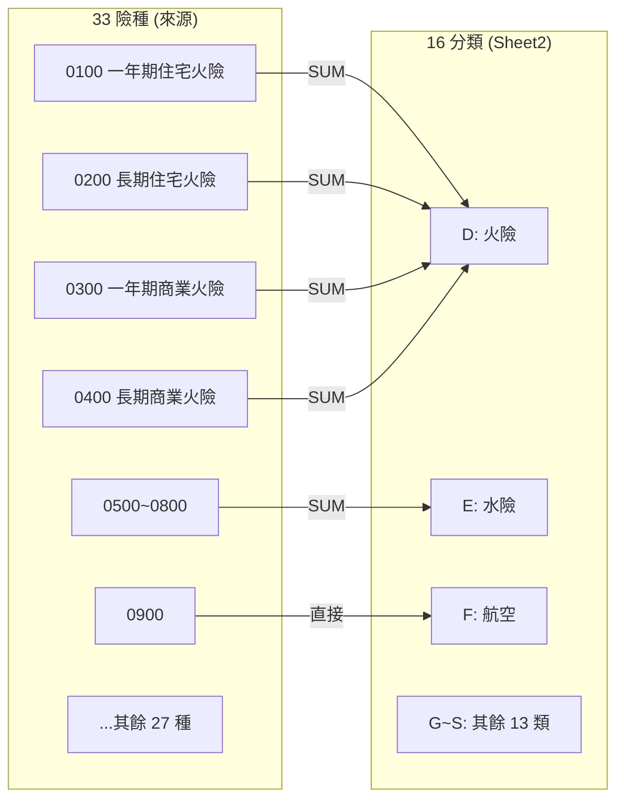

← [回到索引](README.md)

# 第七章：輸入輸出規格

---

## 1. 來源檔名格式

```
{公司別}_{年度}({起始月}-{結束月})_自留保費統計表.xlsx
```



### 季度判定規則（累計制）

| 起始月 | 結束月 | 季度 | 月份標記 |
|--------|--------|------|----------|
| 01 | 03 | Q1 | `1-1Q(1-3)` |
| 01 | 06 | Q2 | `1-2Q(1-6)` |
| 01 | 09 | Q3 | `1-3Q(1-9)` |
| 01 | 12 | Q4 | `1-4Q(1-12)` |

## 2. 來源檔 Excel 結構



## 3. 輸出檔名格式

```
{年度}年產險業務(Q{最大季度}季自留)保費統計表.xlsx
```

## 4. 輸出 Excel 結構

| Sheet | 名稱 | 用途 |
|-------|------|------|
| Sheet 1 | `{年度}自留(季)` | 各公司 × 33 險種明細 |
| Sheet 2 | `{年度}自留總累` | 各公司 × 16 分類彙總 + 去年對比 |
| Sheet 3 | `歸屬` | 險種分類對照表（不修改） |

---

## 5. 資料流圖

### 5.1 資料轉換全流程



### 5.2 Sheet1 寫入映射



### 5.3 Sheet2 險種聚合映射


