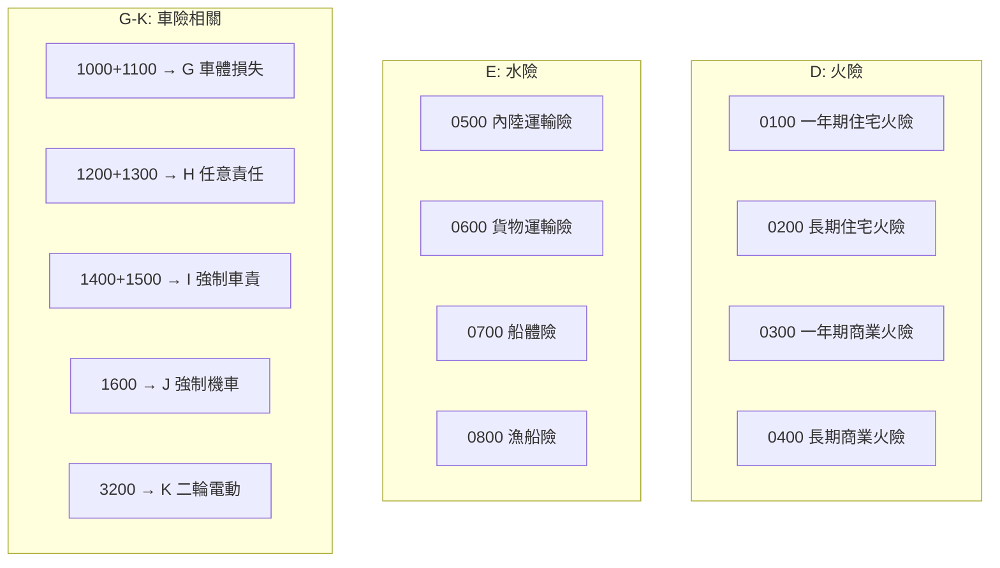
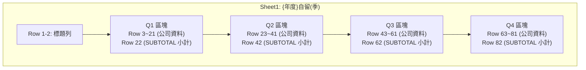
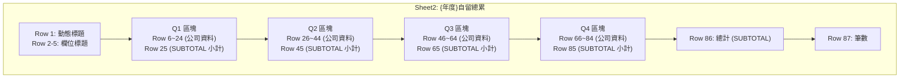
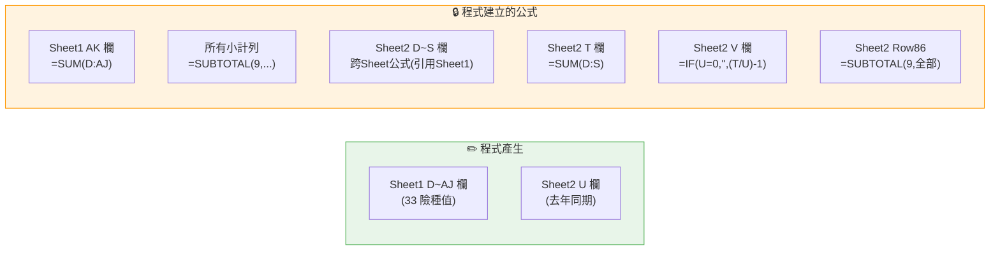
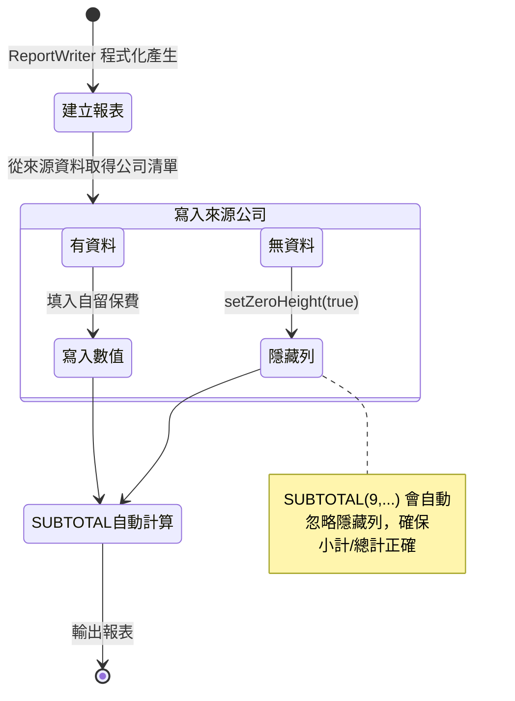

← [回到索引](README.md)

# 第八章：險種歸類與報表產生

---

## 1. 險種歸類規則

險種歸類定義已從程式碼抽離至外部設定檔 `config/insurance-mapping.yml`，由 `InsuranceMappingService` 載入。新增或移除險種只需修改 YAML 設定檔，無需重新編譯程式。

### 33 → 16 歸類對照表

| Sheet2 欄 | 分類名稱 | 組成險種代號 |
|-----------|----------|-------------|
| D | 火險 | 0100 + 0200 + 0300 + 0400 |
| E | 水險 | 0500 + 0600 + 0700 + 0800 |
| F | 航空 | 0900 |
| G | 車體損失險 | 1000 + 1100 |
| H | 任意責任險 | 1200 + 1300 |
| I | 強制車責 (汽車) | 1400 + 1500 |
| J | 強制機車責任險 | 1600 |
| K | 強制二輪電動 | 3200 |
| L | 責任險 | 1700 + 1800 |
| M | 工程險 | 1900 |
| N | 信用保證 | 2100 + 2200 |
| O | 其他財產 | 2000 + 2300 + 2600 + 2700 |
| P | 傷害險 | 2400 |
| Q | 天災險 | 2500 + 2800 + 2900 |
| R | 健康險 | 3000 + 3100 |
| S | 國外分進 | 9900 |

> 📝 以上對照表定義於 `config/insurance-mapping.yml` 的 `categories` 區塊。如需調整歸類，請直接編輯該檔案。詳見[第三章：設定與使用方式](03-設定與使用方式.md)。

---

## 2. 報表產生邏輯

報表透過 Apache POI (XSSFWorkbook) 程式化產生，由 ReportWriter 搭配 ExcelStyleHelper 建立完整的 Excel 報表。

### 2.1 Sheet1 區塊佈局

### 2.2 Sheet2 區塊佈局

### 2.3 公式保留策略

### 2.4 動態公司隱藏機制

