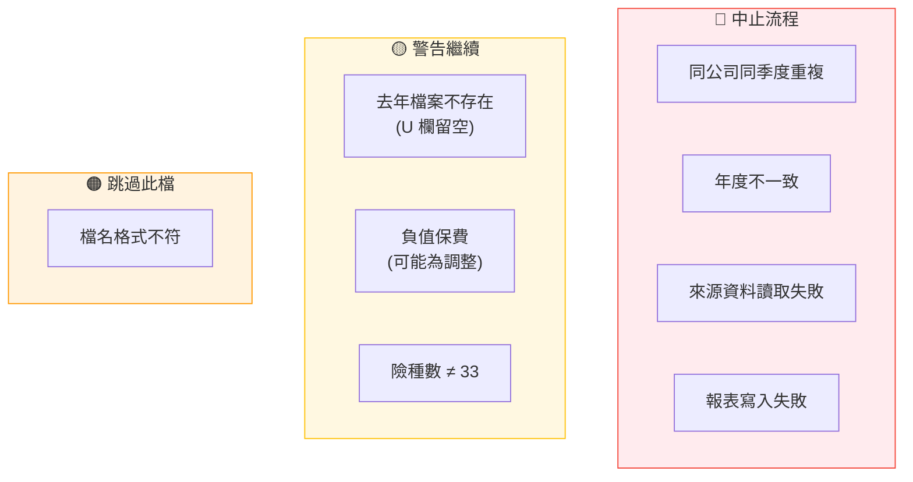

← [回到索引](README.md)

# 第九章：錯誤處理與日誌

---

## 1. 錯誤分類表



## 2. 日誌等級對照

| 情境 | Log 等級 | 行為 |
|------|----------|------|
| 檔名格式不符 | `ERROR` | 跳過此檔，繼續 |
| 來源 Excel 結構異常 | `ERROR` | 跳過此檔，中止流程 |
| 來源資料非數值 | `ERROR` | 跳過此檔，中止流程 |
| 同公司同季度重複 | `ERROR` | 中止整個流程 |
| 年度不一致 | `ERROR` | 中止整個流程 |
| 寫入/輸出失敗 | `ERROR` | 中止整個流程 |
| 去年檔案不存在 | `WARN` | U 欄留空，繼續 |
| 驗算差異 (F≠C+D-E) | `WARN` | 記錄但繼續 |
| 正常處理步驟 | `INFO` | 記錄進度 |

## 3. 日誌輸出範例

```
2026-04-23 17:00:01 [INFO] ReportGenerationService - ===== 自留保費統計表報表轉換系統 =====
2026-04-23 17:00:01 [INFO] ReportGenerationService - 處理年度: 115
2026-04-23 17:00:01 [INFO] ReportGenerationService - 掃描匯入目錄: ./import/115/Q1/
2026-04-23 17:00:01 [INFO] ReportGenerationService - 找到 3 個 .xlsx 檔案
2026-04-23 17:00:01 [INFO] ReportGenerationService - 解析檔名...
2026-04-23 17:00:01 [INFO] ReportGenerationService -   已解析: 29_115(01-03)_自留保費統計表.xlsx → 公司=29, 年度=115, Q1
2026-04-23 17:00:01 [INFO] ReportGenerationService - 前置驗證...
2026-04-23 17:00:02 [INFO] ReportGenerationService - 讀取來源檔案...
2026-04-23 17:00:02 [INFO] ExcelSourceReader - Successfully read source file: ... company=29 (美國國際), entries=33
2026-04-23 17:00:02 [INFO] ReportGenerationService - 按季度分組...
2026-04-23 17:00:02 [INFO] ReportGenerationService - 年度=115, 最大季度=Q1, 涵蓋季度=[1]
2026-04-23 17:00:02 [WARN] LastYearReader - 去年報表不存在: output/114Q1/114年產險業務(Q1季自留)保費統計表.xlsx, U欄將留空
2026-04-23 17:00:03 [INFO] ReportGenerationService - 寫入報表: output/115Q1/115年產險業務(Q1季自留)保費統計表.xlsx
2026-04-23 17:00:03 [INFO] ReportWriter - Report written successfully to output/115Q1/...
2026-04-23 17:00:03 [INFO] ReportGenerationService - ===== 處理完成 =====
```
