# 自留保費統計表報表轉換系統 — 使用手冊

> **版本**：1.0.0  
> **技術棧**：Java 17 / Spring Boot 3.4.1 / Apache POI 5.3.0 / Gradle 8.12

---

## 目錄

1. [系統概述](#1-系統概述)
2. [系統架構圖](#2-系統架構圖)
3. [快速開始](#3-快速開始)
4. [安裝與部署](#4-安裝與部署)
5. [設定說明](#5-設定說明)
6. [使用方式](#6-使用方式)
7. [輸入輸出規格](#7-輸入輸出規格)
8. [處理流程圖](#8-處理流程圖)
9. [模組架構與職責](#9-模組架構與職責)
10. [資料流圖](#10-資料流圖)
11. [險種歸類規則](#11-險種歸類規則)
12. [模板寫入邏輯](#12-模板寫入邏輯)
13. [錯誤處理與日誌](#13-錯誤處理與日誌)
14. [常見問題 (FAQ)](#14-常見問題-faq)

---

## 1. 系統概述

本系統將多個產險公司的「自留保費統計表」Excel 來源檔，自動彙整填入輸出模板，產生季度報表。

### 功能摘要

| 功能 | 說明 |
|------|------|
| 多檔案讀取 | 同時匯入多家公司的來源 Excel |
| 自動險種歸類 | 33 種險種自動歸類為 16 大類 |
| 季度判斷 | 依檔名自動判定季度 (Q1-Q4) |
| 公式保留 | 輸出報表完整保留 Excel 公式 |
| 動態公司顯示 | 僅顯示有資料的公司，隱藏空列 |
| 去年同期比較 | 自動讀取去年報表填入對照欄 |
| 容器化部署 | 支援 Docker 一鍵執行 |

---

## 2. 系統架構圖

### 2.1 整體架構

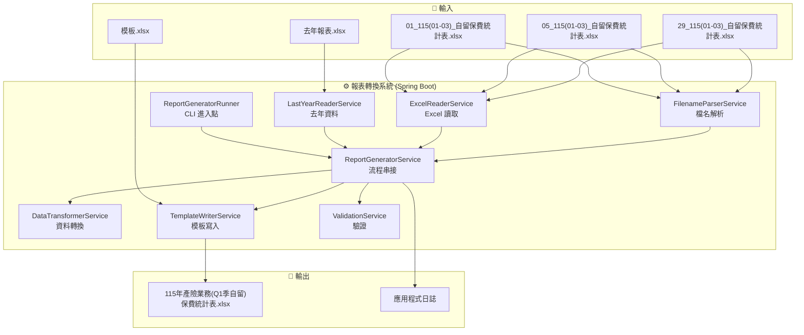

### 2.2 技術架構

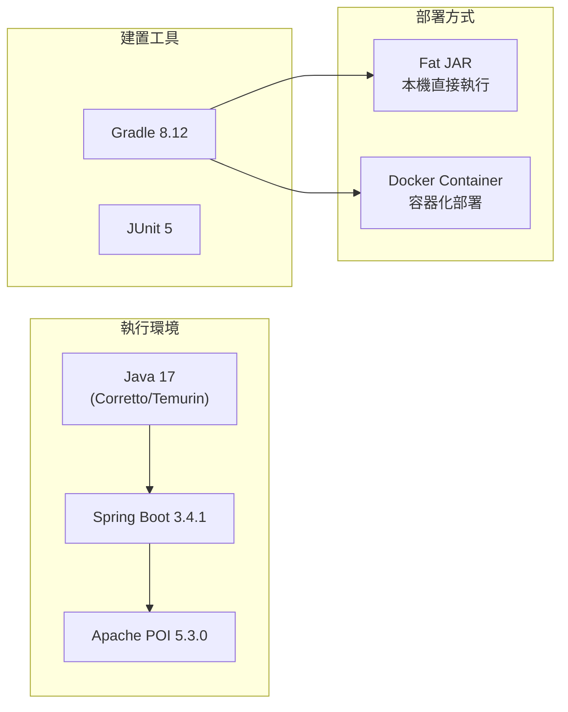

---

## 3. 快速開始

### 前置需求

- **Java 17** (JDK)
- **Docker** (選用，容器化部署)

### 30 秒快速體驗

```bash
# 1. 建立目錄結構
mkdir input output templates lastyear

# 2. 放入模板
cp docs/115年產險業務(Q1季自留)保費統計表.xlsx templates/template.xlsx

# 3. 放入來源檔案
cp docs/29_115(01-03)_自留保費統計表.xlsx input/

# 4. 執行
.\gradlew.bat bootRun

# 5. 查看輸出
ls output/
# → 115年產險業務(Q1季自留)保費統計表.xlsx
```

---

## 4. 安裝與部署

### 4.1 本機執行 (開發/除錯)

```bash
# 建置
.\gradlew.bat build

# 執行（使用 application.yml 預設路徑）
.\gradlew.bat bootRun

# 執行（自訂路徑，以命令列參數覆蓋）
.\gradlew.bat bootRun --args="./input ./templates/template.xlsx ./output ./lastyear"

# 直接使用 JAR
.\gradlew.bat bootJar
java -jar build/libs/retained-premium-report-transformer-0.0.1-SNAPSHOT.jar
```

### 4.2 Docker 部署

```bash
# 建置映像檔
docker-compose build

# 執行
docker-compose up

# 背景執行
docker-compose up -d
```

#### Docker 目錄掛載

```
./input/       → /data/input       (來源檔案)
./output/      → /data/output      (輸出目錄)
./templates/   → /data/templates   (模板檔案)
./lastyear/    → /data/lastyear    (去年報表)
```

### 4.3 目錄結構

```
project-root/
├── input/                     # 放入來源 xlsx 檔案
│   ├── 29_115(01-03)_自留保費統計表.xlsx
│   ├── 05_115(01-03)_自留保費統計表.xlsx
│   └── ...
├── output/                    # 系統自動產出報表
│   └── 115年產險業務(Q1季自留)保費統計表.xlsx
├── templates/
│   └── template.xlsx          # 輸出模板（必須）
├── lastyear/                  # 去年報表（選用）
│   └── 114年產險業務(Q1季自留)保費統計表.xlsx
└── (程式碼目錄)
```

---

## 5. 設定說明

### 5.1 application.yml

```yaml
app:
  input-dir: ./input                           # 來源檔案目錄
  output-dir: ./output                         # 輸出目錄
  template-path: ./templates/template.xlsx     # 模板路徑
  last-year-dir: ./lastyear                    # 去年報表目錄

logging:
  level:
    com.example.retainedpremium: INFO          # 日誌等級
```

### 5.2 覆蓋優先順序

```
命令列參數 > 環境變數 > application.yml
```

| 參數位置 | application.yml | 環境變數 | CLI 參數 |
|----------|-----------------|----------|----------|
| 輸入目錄 | `app.input-dir` | `APP_INPUT_DIR` | 第 1 個參數 |
| 模板路徑 | `app.template-path` | `APP_TEMPLATE_PATH` | 第 2 個參數 |
| 輸出目錄 | `app.output-dir` | `APP_OUTPUT_DIR` | 第 3 個參數 |
| 去年目錄 | `app.last-year-dir` | `APP_LAST_YEAR_DIR` | 第 4 個參數 |

---

## 6. 使用方式

### 6.1 基本用法

1. 將所有來源 `.xlsx` 檔案放入 `input/` 目錄
2. 確認 `templates/template.xlsx` 存在
3. 執行程式
4. 從 `output/` 取得產出報表

### 6.2 多公司匯入

放入多個來源檔案，系統會自動合併：

```
input/
├── 01_115(01-03)_自留保費統計表.xlsx    # 台產
├── 05_115(01-03)_自留保費統計表.xlsx    # 富邦
├── 29_115(01-03)_自留保費統計表.xlsx    # 美國國際
└── 32_115(01-03)_自留保費統計表.xlsx    # 美商安達
```

輸出：`115年產險業務(Q1季自留)保費統計表.xlsx`（僅顯示這 4 家公司，其餘隱藏）

### 6.3 多季度匯入

同時放入不同季度的檔案，系統會自動填入對應區塊：

```
input/
├── 29_115(01-03)_自留保費統計表.xlsx    # Q1
├── 29_115(01-06)_自留保費統計表.xlsx    # Q2
└── 05_115(01-03)_自留保費統計表.xlsx    # Q1
```

輸出：`115年產險業務(Q2季自留)保費統計表.xlsx`（檔名用最大季度）

### 6.4 去年同期對比

將去年報表放入 `lastyear/` 目錄：

```
lastyear/
└── 114年產險業務(Q1季自留)保費統計表.xlsx
```

系統會自動讀取 Sheet2 的 T 欄值填入 U 欄（去年同期合計），並計算成長率。

> ⚠️ 若去年檔案不存在，U 欄留空，日誌記錄 WARN，不影響其他功能。

---

## 7. 輸入輸出規格

### 7.1 來源檔名格式

```
{公司別}_{年度}({起始月}-{結束月})_自留保費統計表.xlsx
```

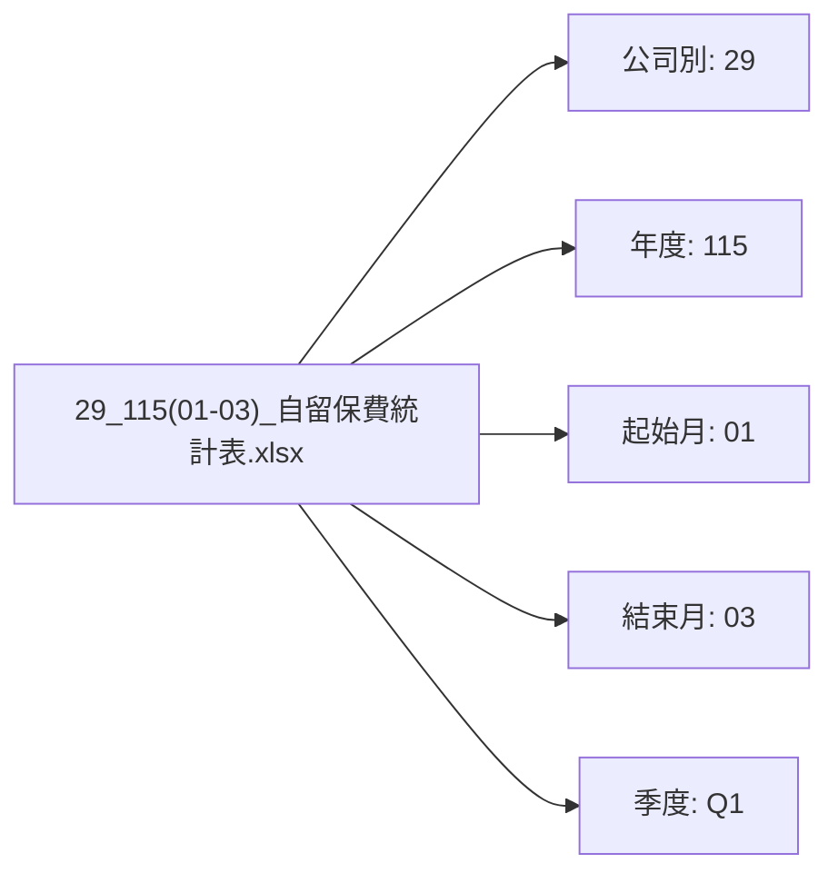

#### 季度判定規則（累計制）

| 起始月 | 結束月 | 季度 | 月份標記 |
|--------|--------|------|----------|
| 01 | 03 | Q1 | `1-1Q(1-3)` |
| 01 | 06 | Q2 | `1-2Q(1-6)` |
| 01 | 09 | Q3 | `1-3Q(1-9)` |
| 01 | 12 | Q4 | `1-4Q(1-12)` |

### 7.2 來源檔 Excel 結構

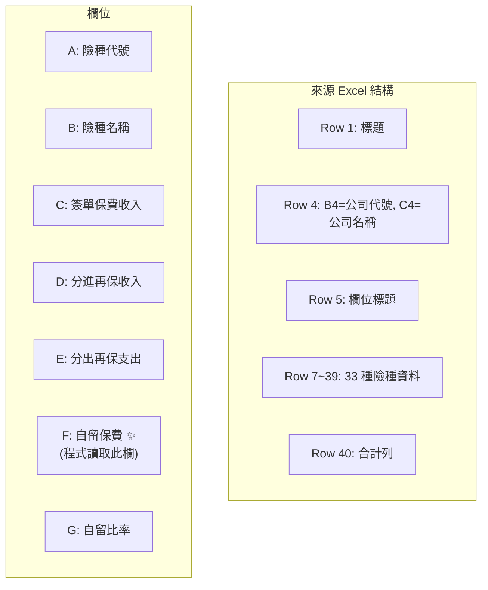

### 7.3 輸出檔名格式

```
{年度}年產險業務(Q{最大季度}季自留)保費統計表.xlsx
```

### 7.4 輸出 Excel 結構

| Sheet | 名稱 | 用途 |
|-------|------|------|
| Sheet 1 | `{年度}自留(季)` | 各公司 × 33 險種明細 |
| Sheet 2 | `{年度}自留總累` | 各公司 × 16 分類彙總 + 去年對比 |
| Sheet 3 | `歸屬` | 險種分類對照表（不修改） |

---

## 8. 處理流程圖

### 8.1 主流程

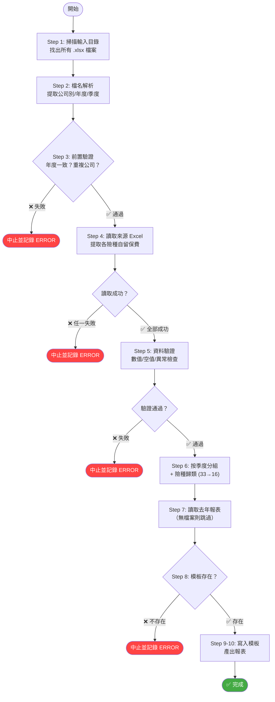

### 8.2 模板寫入細節流程

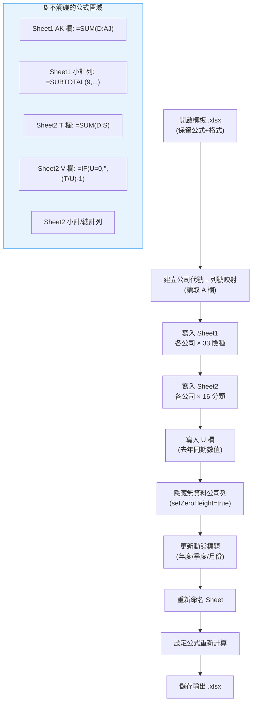

---

## 9. 模組架構與職責

### 9.1 類別圖

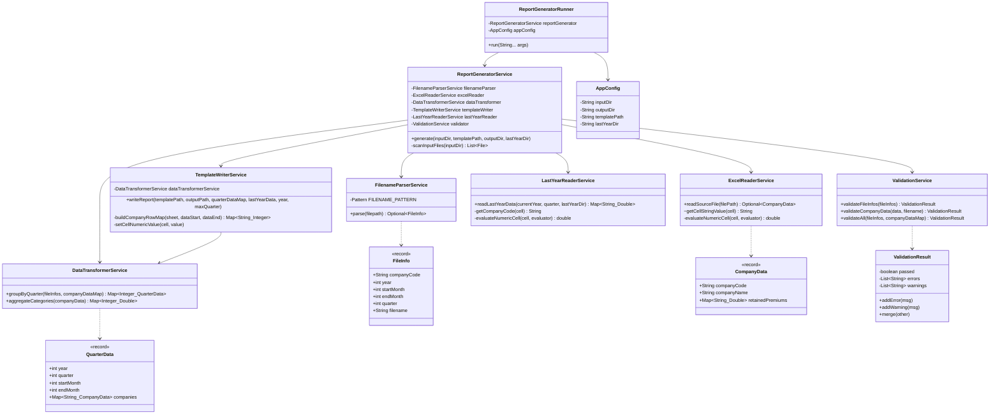

### 9.2 模組依賴關係

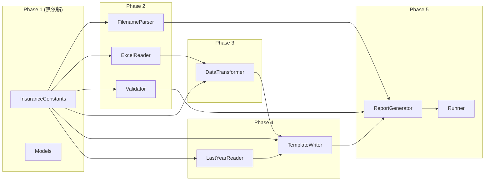

---

## 10. 資料流圖

### 10.1 資料轉換全流程

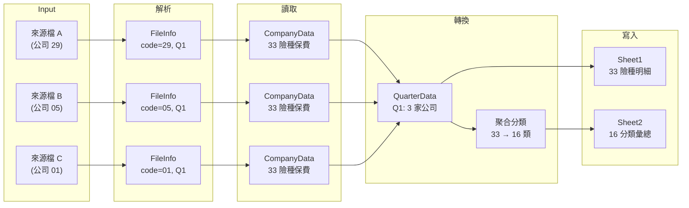

### 10.2 Sheet1 寫入映射

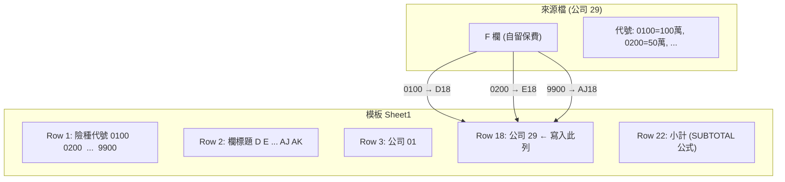

### 10.3 Sheet2 險種聚合映射

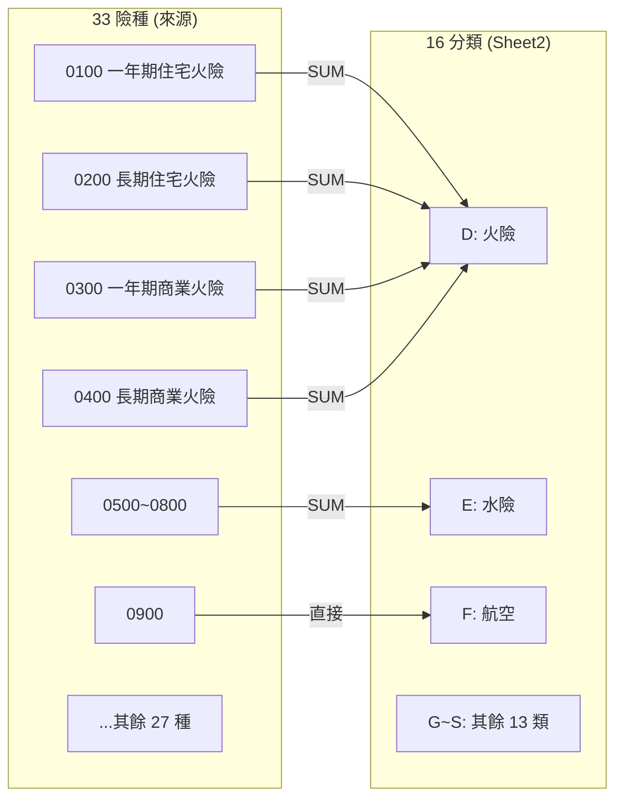

---

## 11. 險種歸類規則

### 33 → 16 歸類對照表

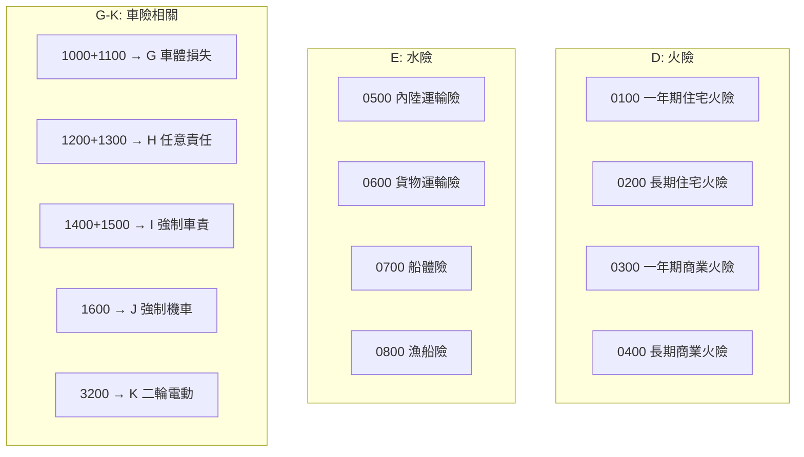

| Sheet2 欄 | 分類名稱 | 組成險種代號 |
|-----------|----------|-------------|
| D | 火險 | 0100 + 0200 + 0300 + 0400 |
| E | 水險 | 0500 + 0600 + 0700 + 0800 |
| F | 航空 | 0900 |
| G | 車體損失險 | 1000 + 1100 |
| H | 任意責任險 | 1200 + 1300 |
| I | 強制車責 (汽車) | 1400 + 1500 |
| J | 強制機車責任險 | 1600 |
| K | 強制二輪電動 | 3200 |
| L | 責任險 | 1700 + 1800 |
| M | 工程險 | 1900 |
| N | 信用保證 | 2100 + 2200 |
| O | 其他財產 | 2000 + 2300 + 2600 + 2700 |
| P | 傷害險 | 2400 |
| Q | 天災險 | 2500 + 2800 + 2900 |
| R | 健康險 | 3000 + 3100 |
| S | 國外分進 | 9900 |

---

## 12. 模板寫入邏輯

### 12.1 Sheet1 區塊佈局

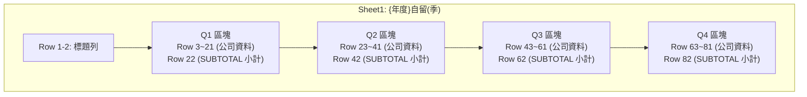

### 12.2 Sheet2 區塊佈局

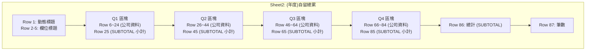

### 12.3 公式保留策略

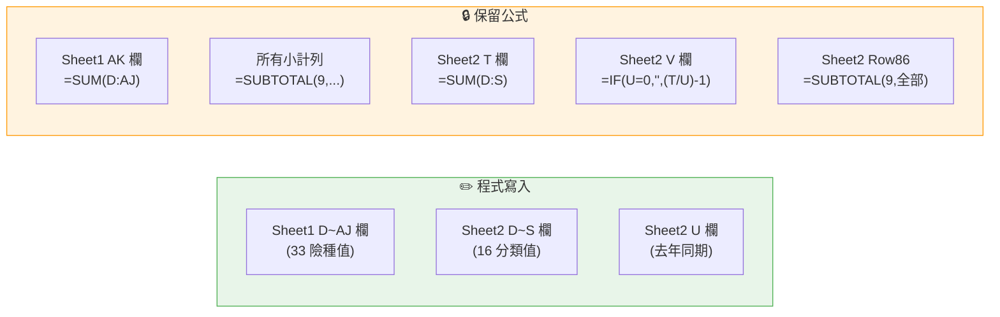

### 12.4 動態公司隱藏機制

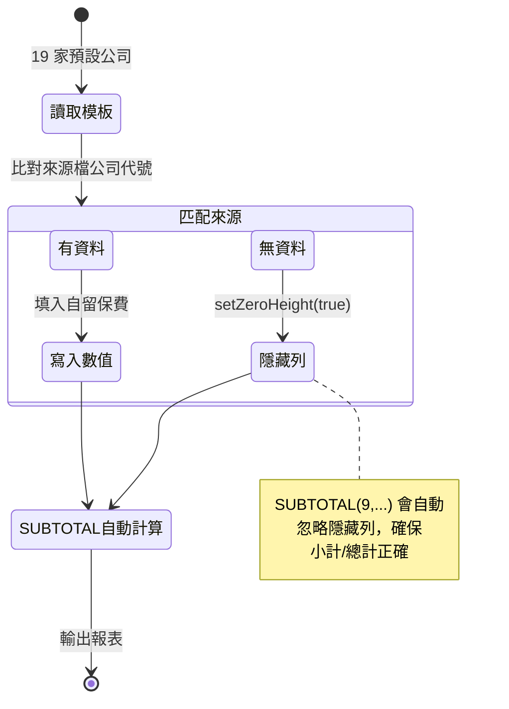

---

## 13. 錯誤處理與日誌

### 13.1 錯誤分類表

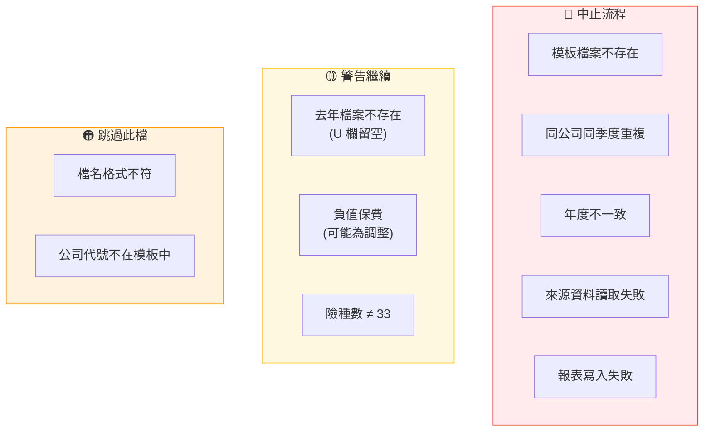

### 13.2 日誌等級對照

| 情境 | Log 等級 | 行為 |
|------|----------|------|
| 檔名格式不符 | `ERROR` | 跳過此檔，繼續 |
| 來源 Excel 結構異常 | `ERROR` | 跳過此檔，中止流程 |
| 來源資料非數值 | `ERROR` | 跳過此檔，中止流程 |
| 公司代號不在模板中 | `ERROR` | 跳過此公司 |
| 同公司同季度重複 | `ERROR` | 中止整個流程 |
| 年度不一致 | `ERROR` | 中止整個流程 |
| 模板/Sheet 不存在 | `ERROR` | 中止整個流程 |
| 寫入/輸出失敗 | `ERROR` | 中止整個流程 |
| 去年檔案不存在 | `WARN` | U 欄留空，繼續 |
| 驗算差異 (F≠C+D-E) | `WARN` | 記錄但繼續 |
| 正常處理步驟 | `INFO` | 記錄進度 |

### 13.3 日誌輸出範例

```
2026-04-23 17:00:01 [INFO] ReportGeneratorRunner - ===== 自留保費統計表報表轉換系統 =====
2026-04-23 17:00:01 [INFO] ReportGeneratorService - 掃描輸入目錄: ./input
2026-04-23 17:00:01 [INFO] ReportGeneratorService - 找到 3 個 .xlsx 檔案
2026-04-23 17:00:01 [INFO] ReportGeneratorService - 解析檔名...
2026-04-23 17:00:01 [INFO] ReportGeneratorService -   已解析: 29_115(01-03)_自留保費統計表.xlsx → 公司=29, 年度=115, Q1
2026-04-23 17:00:01 [INFO] ReportGeneratorService - 前置驗證...
2026-04-23 17:00:02 [INFO] ReportGeneratorService - 讀取來源檔案...
2026-04-23 17:00:02 [INFO] ExcelReaderService - Successfully read source file: ... company=29 (美國國際), entries=33
2026-04-23 17:00:02 [INFO] ReportGeneratorService - 按季度分組...
2026-04-23 17:00:02 [INFO] ReportGeneratorService - 年度=115, 最大季度=Q1, 涵蓋季度=[1]
2026-04-23 17:00:02 [WARN] LastYearReaderService - 去年報表不存在: 114年產險業務(Q1季自留)保費統計表.xlsx, U欄將留空
2026-04-23 17:00:03 [INFO] ReportGeneratorService - 寫入報表: output/115年產險業務(Q1季自留)保費統計表.xlsx
2026-04-23 17:00:03 [INFO] TemplateWriterService - Report written successfully to output/...
2026-04-23 17:00:03 [INFO] ReportGeneratorService - ===== 處理完成 =====
```

---

## 14. 常見問題 (FAQ)

### Q: 程式執行後沒有產出檔案？

檢查 log 輸出。常見原因：
1. `input/` 目錄中沒有 `.xlsx` 檔案
2. 檔名格式不符規定
3. `templates/template.xlsx` 不存在
4. 來源資料有誤導致中止

### Q: 輸出報表的公式沒有計算結果？

這是正常的。程式設定了 `setForceFormulaRecalculation(true)`，用 Excel 開啟檔案時會自動重新計算所有公式。

### Q: 可以同時處理不同年度嗎？

不可以。系統會驗證所有來源檔的年度必須一致，不同年度會中止處理。

### Q: 新增一家公司（不在模板的 19 家中）怎麼辦？

目前需修改模板 Excel，在各季度區塊中新增該公司的列。程式會自動讀取模板中的公司代號進行匹配。

### Q: Docker 環境如何看 log？

```bash
docker-compose logs -f report-transformer
```

### Q: 如何修改日誌等級？

方式一：修改 `application.yml`
```yaml
logging:
  level:
    com.example.retainedpremium: DEBUG
```

方式二：透過環境變數
```bash
LOGGING_LEVEL_COM_EXAMPLE_RETAINEDPREMIUM=DEBUG
```
